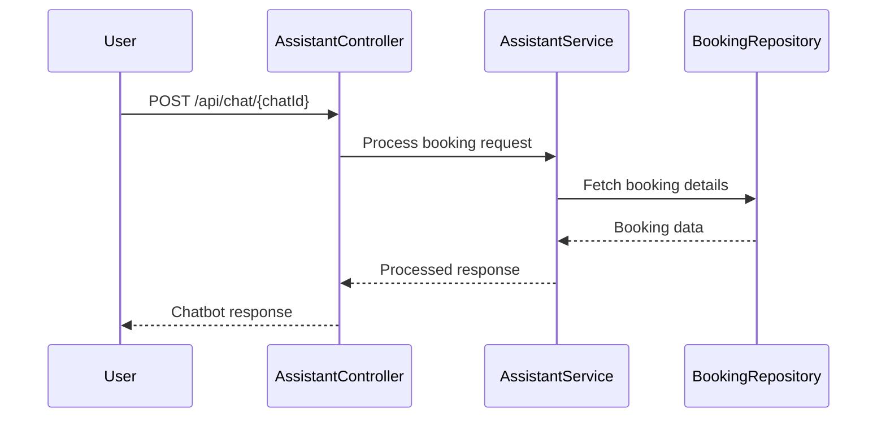

# Airline Booking Customer Support Agent

This module provides a chatbot-based customer support system for airline bookings. It includes the following key components:

- **AssistantController**: A REST controller to handle chat interactions.
- **AssistantService**: A service to manage booking operations such as fetching, changing, and canceling bookings.
- **AssistantTool**: A tool to expose booking-related functionalities to the chatbot.
- **Repositories**: Includes `CustomerRepository` and `BookingRepository` for database interactions.
- **Models**: Includes `Customer`, `Booking`, `BookingDetails`, and related enums.

## Sequence Diagram

## Implementation Details

### AssistantController

- Handles chat interactions via the `/api/chat` endpoint.
- Uses `AssistantService` to process user requests.

### AssistantService

- Manages booking operations such as fetching, changing, and canceling bookings.
- Interacts with `BookingRepository` and `CustomerRepository` for database operations.

### AssistantTool

- Provides tools for the chatbot to interact with booking functionalities.
