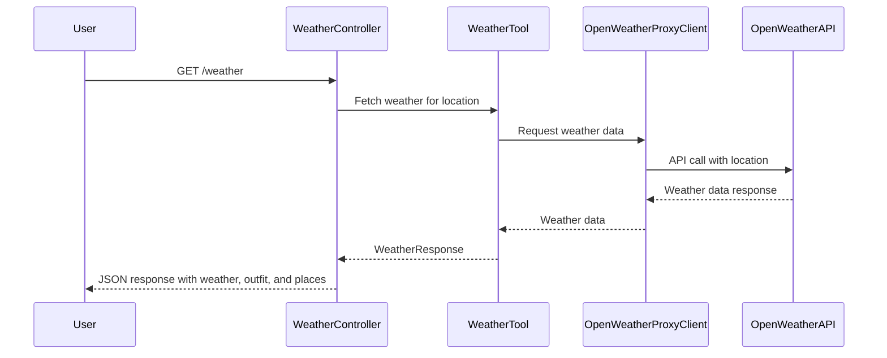

# Get Weather, Outfit, and Places by Location

This module provides functionality to fetch weather information, suggest outfits, and recommend places to visit based on a given location. It includes the following key components:

- **WeatherController**: A REST controller to handle weather-related requests.
- **WeatherTool**: A service to fetch weather data using the OpenWeather API.
- **OpenWeatherProxyClient**: A proxy client to interact with the OpenWeather API.
- **Models**: Includes `WeatherResponse`, `Location`, and other related data structures.

## Sequence Diagram

## Implementation Details

### WeatherController

- Handles the `/weather` endpoint.
- Uses `WeatherTool` to fetch weather data and generate a response.

### WeatherTool

- Fetches weather data using `OpenWeatherProxyClient`.
- Processes the data to suggest outfits and places to visit.

### OpenWeatherProxyClient

- Interacts with the OpenWeather API to fetch weather data.
