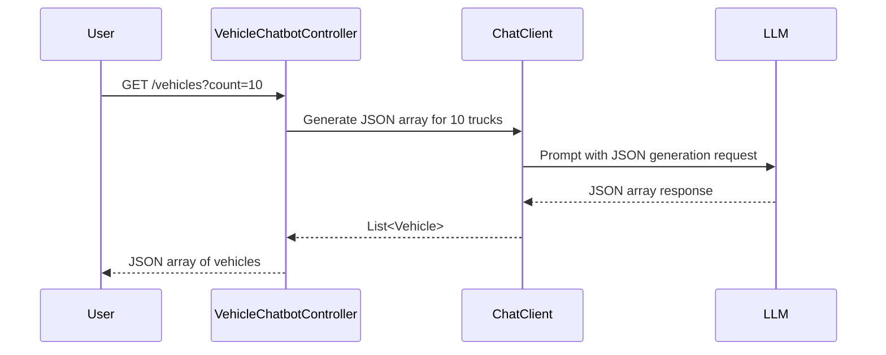

# Vehicle Fake Data Generator

This module provides functionality to generate fake vehicle data using a chatbot interface. It includes the following key components:

- **VehicleChatbotController**: A REST controller to handle requests for generating vehicle data.
- **Vehicle**: A record representing the structure of a vehicle object.

## Sequence Diagram

## Implementation Details

### VehicleChatbotController

- Handles the `/vehicles` endpoint.
- Uses `ChatClient` to interact with the LLM for generating vehicle data.

### Vehicle

- Represents the structure of a vehicle object with fields like `id`, `vin`, `brand`, etc.
